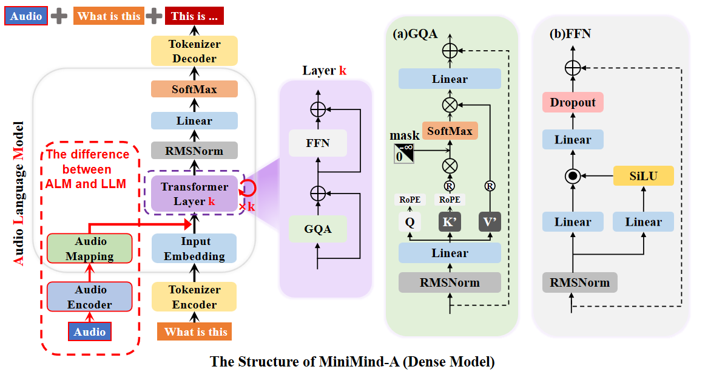

# minimind-a
此项目是在26M参数的超小大语言模型MiniMind和MiniMind-V的基础上开发的超小多模态语音大模型MiniMind-A。
## Pipeline

  
 
Fig 1. Finetuning of the understanding model, emphasizing on enhance the model's understanding in the following aspects: 1. Binary choice: tell whether the image belongs to a specific emotion category or not. 2. Multiple Choice: tell which emotion category the image belongs to, among the 8 given choices. 3.Misleading choice: given a easily confused option, asking the model to decide whether it's correct or not. 

